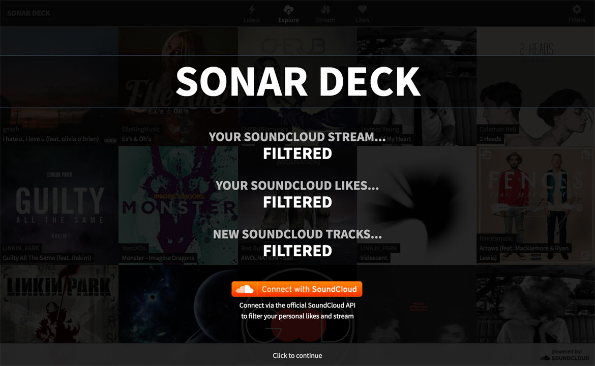

# SONAR DECK
SonarDeck is a free web app that filters your SoundCloud stream, likes and new music tracks. Built with AngularJS and powered by the SoundCloud API. Developed by Lewis Hunt.

## Link
Try it out here: www.sonardeck.com

Chrome is the recommended browser. It should also work in Firefox and Safari but performance will be slower.

## About
I love SoundCloud.

But there is a problem with its filtering capabilities. Especially in the music stream of people you follow (https://soundcloud.com/stream). 

I therefore designed and built SonarDeck so  I could quickly filter my stream, refine my liked tracks and browse new music. I know there are other web apps out there that allow you to filter SoundCloud, but I wanted more control and speed over the filtering. AngularJS, HTML5 and CSS3 were good technologies to accomplish this.

## Instructions
Use the app at www.sonardeck.com

The four main sections in the app are Latest, Explore, Stream and Likes.

Latest and Explore are available for all users. The Stream and Likes sections are personalised lists so you will need to log in to your SoundCloud account.

### Latest
The Latest section lists new track uploads to SoundCloud. On the right there are specific filters available such as track type (original, demo etc...).

### Explore
The Explore section allows you to explore popular tracks in a particular genre, or search for any track. On the right there are specific filters such as genres and keywords.

### Stream
The Stream section presents your personalised music stream for the people you follow. On the right you can filter your stream to for example, hide reposts and/or playlists.

### Likes
The Likes section lists the tracks you have favourited or liked. On the right you can filter this list via keywords. Liked Playlists are coming soon.

### Filters
All the above sections have their own powerful AngularJS-driven filters. There are various checkbox/radio filters for track types and keyword filters for username, tags, genre, track title etc... 

A few features worth mentioning are:

- Filtering reposts. In the Stream section you can filter out reposts or playlists, leaving only the new uploaded tracks from the people you follow. Take a look at the demo at the top of this read-me page for an example.

- Multiple Keywords. Using commas for multiple keywords. For example: 'pop, rock, alternative' will filter and show tracks containing these any of these words. Take a look at the demo at the top of this read-me page for an example.

- Subtractive Filtering. By prefixing an exclamation mark (!) before the keywords, it will filter out those terms rather than filter them in. For example, '!pop, rock, alternative' will filter out and remove tracks containing these words.

- There is a global App Player Settings section that allows you to turn on/off autoplay and comments.
 
## Issues
The app is still in development so let me know of any issues or suggestions. See links in the Support section.

For speed of development and to remove playback rate-limit constraints (https://developers.soundcloud.com/docs/api/rate-limits) audio playback is using the SoundCloud Widget API.

Using the Widget API has a knock-on effect of slower performance on some mobile devices. Also autoplay may not work on mobile devices.

## Support
This app is built by Lew Hunt using HTML5, CSS3, JS, AngularJS and powered by the SoundCloud API. Specific modules used are listed in the Credits section

If you like using this app and/or have any suggestions you can follow me via this github account or any of these links:

https://twitter.com/SonarDeck

https://twitter.com/Lew_Hunt

https://soundcloud.com/sonardeck

https://soundcloud.com/lewhunt

## Credits
Thanks to the following for providing useful modules:

https://github.com/vitalets/checklist-model

https://github.com/gsklee/ngStorage

https://github.com/sroze/ngInfiniteScroll

https://github.com/daneden/animate.css

https://github.com/codrops/Blueprint-ResponsiveFullWidthGrid

http://stackoverflow.com/questions/24503882/the-google-cards-flip-and-grow-effect

https://github.com/soundcloud/soundcloud-javascript

https://w.soundcloud.com/player/api_playground.html

https://github.com/angular

